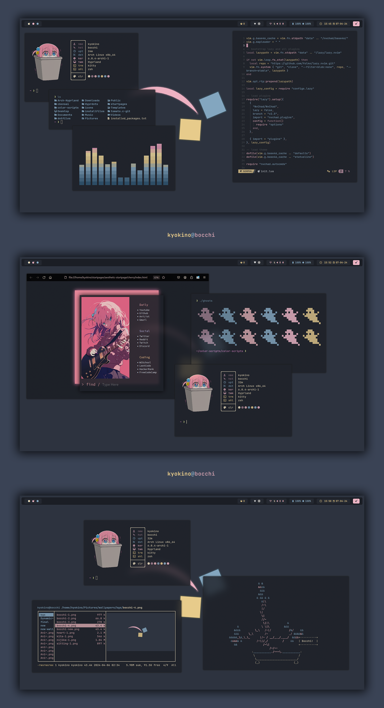
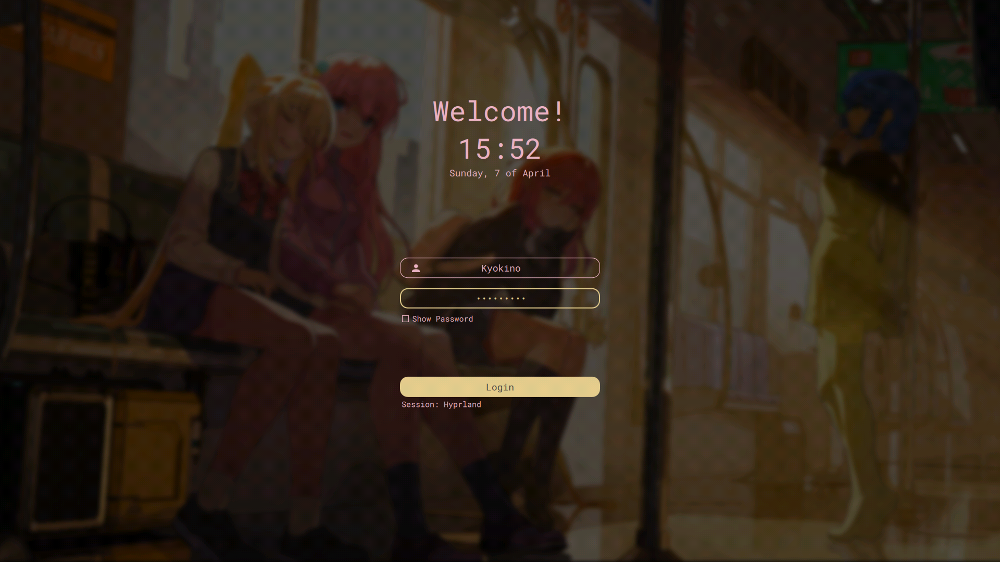
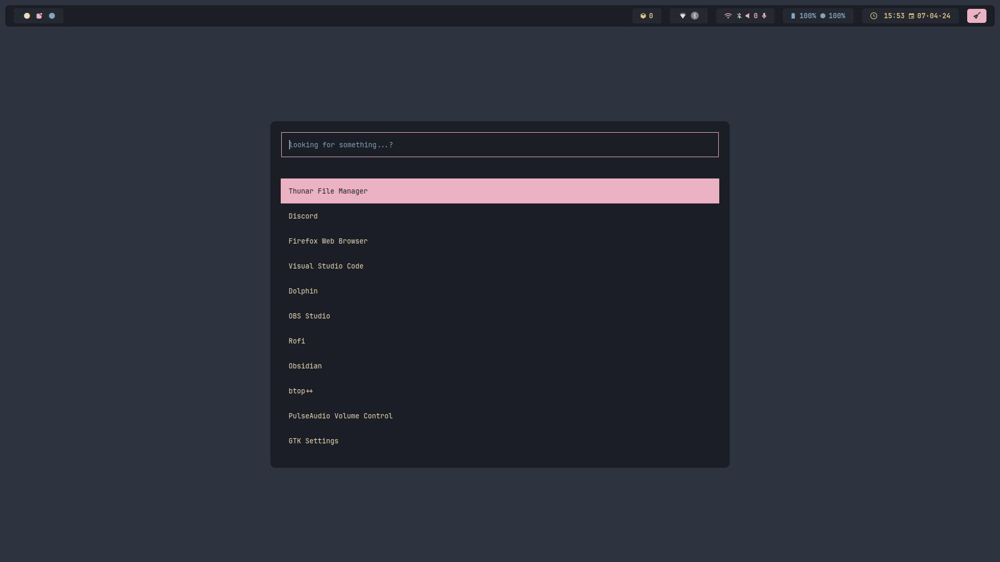

<!-- <h1 align="center"> Minimal Bocchi</h1> -->

  

First ever 'official' rice. Based on <a href="https://anilist.co/anime/130003/BOCCHI-THE-ROCK/">ぼっち・ざ・ろっく！</a>

## Programs

List of programs and tools I use.

| Component         | Program    |
|-------------------|------------|
| Windows Manager 🪟| [hyprland](URL-to-Hyprland-Repo)  |
| Terminal 🖥️       | [kitty](URL-to-Kitty-Repo)        |
| Shell 🐚          | [zsh](URL-to-Zsh-Repo) / [theme](URL-to-P10K-Repo) |
| Fetch 🖼️          | [catnip](URL-to-Catnip-Repo) / [icon](URL-to-Catnip-img-Repo) |
| File Manager 📁   | [ranger](URL-to-Ranger-Repo)      |
| Editor 📝         | [neovim](URL-to-Neovim-Repo)      |
| Browser 🌐        | [firefox](URL-to-Firefox-Repo) / [startpage](URL-to-Aesthetic-startpages) |
| Bar 📊            | [waybar](URL-to-Waybar-Repo)      |
| Launcher 🚀       | [rofi](URL-to-Rofi-Repo)          |
| Color Theme 🎨    | [pywal](URL-to-Pywal-Repo)        |
| Lockscreen 🔒     | [hyprlock](URL-to-Hyprlock-Repo)  |
| Login Menu 🚪     | [sddm](URL-to-SDDM-Repo)          |
| Music Player 🎵   | [ncspot](URL-to-Ncspot-Repo)      |
| Visualiser 📊     | [cava](URL-to-Cava-Repo)          |
| Lyrics 🎤         | [sptlrx](URL-to-Sptlrx-Repo)      |
| Pomodoro 🍅       | [tomato](URL-to-Tomato-Repo)      |
| Others 🌱         | [cbonsai](URL-to-Cbonsai-Repo), [colorscripts](URL-to-Colorscripts-Repo), [asciiquarium](URL-to-Asciiquarium-Repo) |

## Preview

## Credits

Lorem ipsum

## More Screenshots

